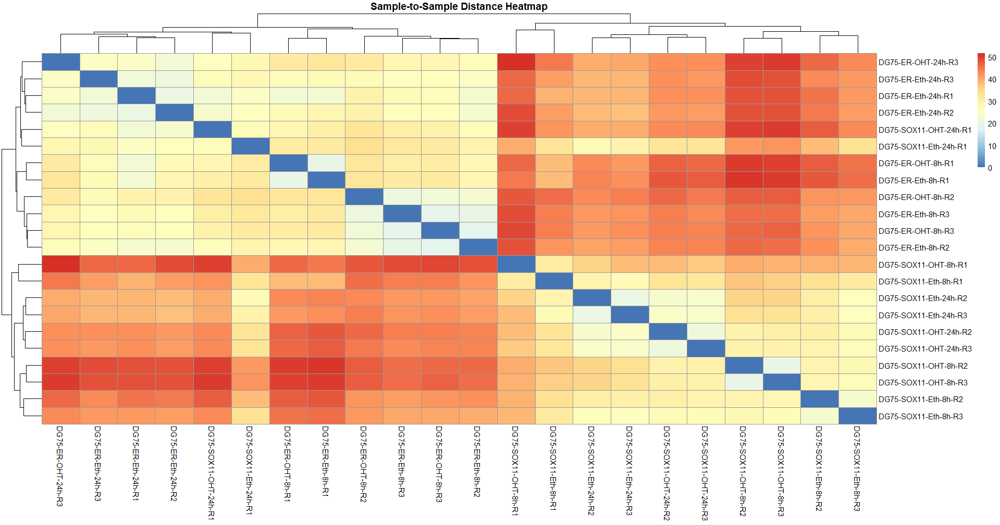
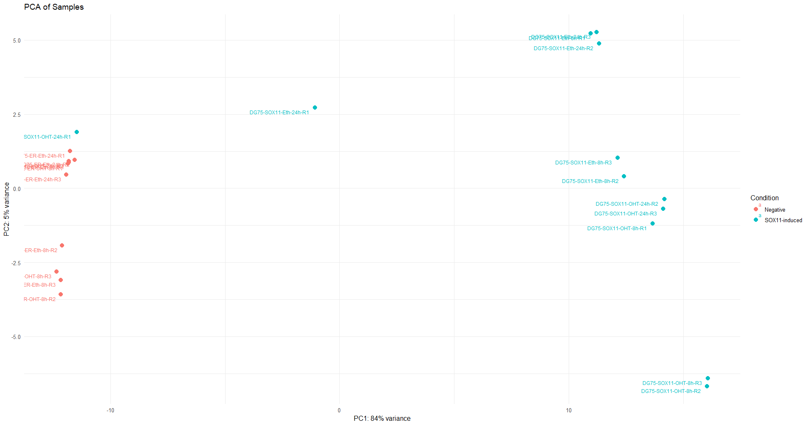
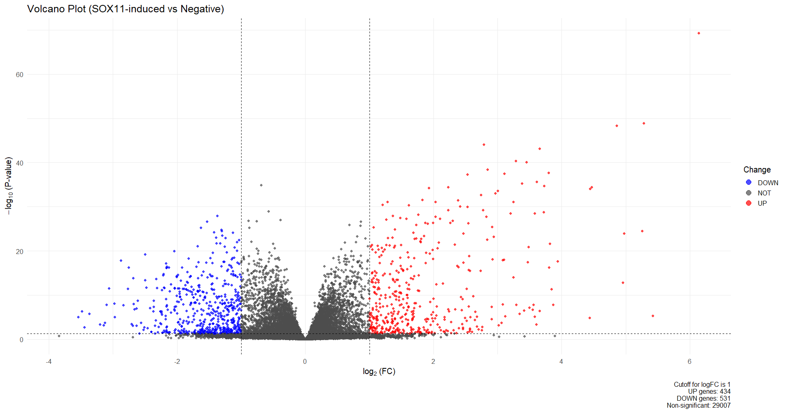
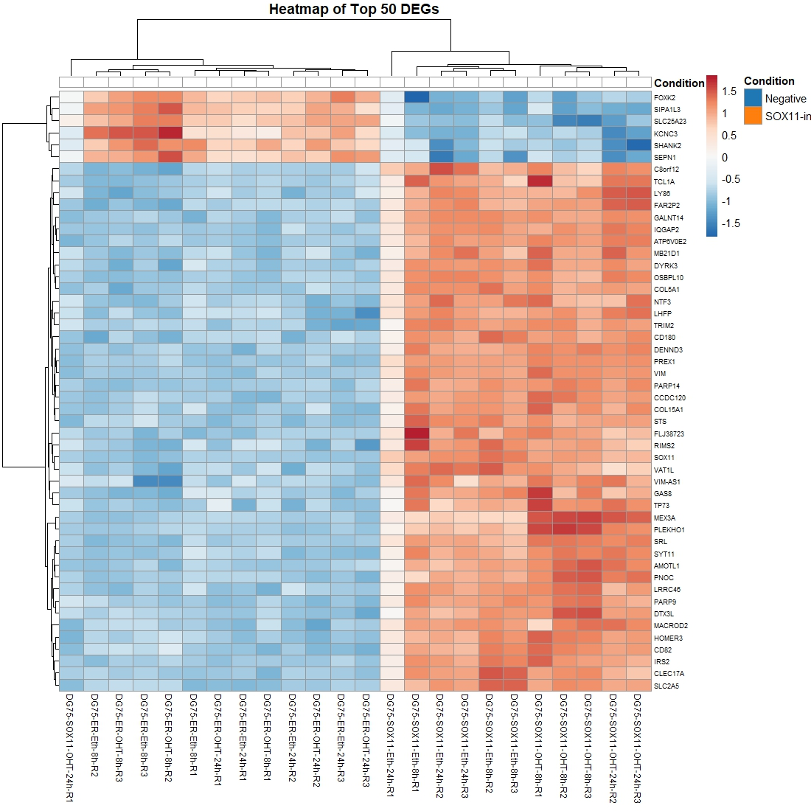

# Transcriptomic Analysis of SOX11-induced Gene Expression: Reproducible RNA-seq Workflow

## Table of Contents
- [Project Overview](#project-overview)
- [Data Source](#data-source)
- [Repository Structure](#repository-structure)
- [Dependencies and Requirements](#dependencies-and-requirements)
- [Installation](#installation)
- [Usage/Workflow](#usageworkflow)
- [Methods](#methods)
    - [Retrieval & Preprocessing](#retrieval--preprocessing)
    - [Pseudo-alignment & Quantification](#pseudo-alignment--quantification)
    - [Quality Control & Visualization](#quality-control--visualization)
    - [Differential Expression Analysis](#differential-expression-analysis)
    - [Gene Set Enrichment & Network Analysis](#gene-set-enrichment--network-analysis)
    - [Clinical Correlation Survival Analysis](#clinical-correlation-survival-analysis)
- [Results](#results)
- [Outputs](#outputs)
- [Figures and Visualizations](#figures-and-visualizations)
- [References](#references)
- [Citation](#citation)
- [Contact](#contact)

---

## Project Overview
This repository contains a fully reproducible workflow for transcriptome analysis of SOX11-induced gene expression changes. It integrates UNIX (Nextflow) and R scripts for differential gene expression, quality control, and downstream analyses, following robust reproducibility and FAIR data principles. All code, configuration, and file structure are documented and organized for transparency and ease of use, with figures and results directly referenced from the companion manuscript.

## Data Source
- **Raw RNA-seq Data:** NCBI BioProject PRJNA1097853
- **Metadata:** Provided in `data/metadata/metadata.csv`
- **Reference Transcriptome:** NCBI GRCh38 (included in `data/reference/`)

## Repository Structure
```
project-root/
├── README.md
├── LICENSE
├── .gitignore
├── scripts/
│   ├── 01_data_retrieval.sh            # Automatic SRA data fetching with nf-core/fetchngs
│   ├── 02_run_rnaseq_pipeline.sh          # Nextflow workflow for QC, trimming (TrimGalore), and summary (MultiQC)
│   ├── 03_deg_analysis.R               # Main R script for DESeq2 analysis of gene counts
│   ├── 04_sample-to-sample similarity.R             # PCA, sample distance, cluster analysis scripts
├── data/
│   ├── raw/                            #  raw FASTQ files deposited in NCBI BioProject PRJNA1097853
│   ├── processed/                      # Gene count tables post-alignment
│   ├── metadata/metadata.csv           # Sample sheet/condition assignment
│   └── reference/GRCh38_transcriptome_info.txt
├── configs/
│   ├── nf-params.json                  # Nextflow parameter file
├── results/
│   ├── deseq2/
│   │   ├── DESeq2_DEGs_results.csv         # All gene stats
│   │   └── DESeq2_DEGs_significant.csv     # Significant DEGs (padj < 0.05)
│   ├── figures/
│   │   ├── sample_distance_heatmap.JPEG     # Cluster heatmap
│   │   ├── pca_plot.jpeg                    # PCA by phenotype
│   │   ├── Volcano_plot_Log2FC I1I.jpeg       # Volcano plot (padj < 0.05, |log2FC| > 1)
│   │   ├── Volcano_plot_Log2FC I1I_gene_names.jpeg       # Labeled volcano (padj < 0.01, |log2FC| > 1)
│   │   └── TOP 50 genes heatmap.jpeg         # Top 50 DEGs heatmap
│   └── tables/

```

## Dependencies and Requirements
### Bioinformatics Tools
- Nextflow v24.10.5
- nf-core/fetchngs v1.13.0
- nf-core/rnaseq v3.18.0
- TrimGalore v0.6.10
- Cutadapt v4.9
- FastQC
- MultiQC v1.25
- Kallisto v0.51.1

### R Packages
- R ≥ 4.3.3
- DESeq2 v1.28.0
- tidyverse
- pheatmap
- EnhancedVolcano
- ggrepel
- RColorBrewer
- dplyr
- ggplot2
- TXIMETA/TXIMPORT v1.20.1
- readxl

### System
- Docker
- Linux/Unix environment recommended

## Installation
Clone this repo and ensure all above dependencies (bioinformatics tools and R packages) are installed (see `setup_instructions.md` for Conda/R/Docker details and version pinning).

## Usage/Workflow
1. **Data Retrieval**
   - Fetch raw FASTQ files via `01_data_retrieval.sh` (uses nf-core/fetchngs)
2. **Preprocessing/QC**
   - Run adapter trimming, quality filtering, and MultiQC via Nextflow pipeline in `02_preprocessing_qc.nf`
3. **Pseudo-alignment & Quantification**
   - Quantify transcripts with Kallisto; summarize with TXIMPORT (automated/Nextflow or manual)
4. **Differential Expression (DEG) Analysis**
   - Process counts and metadata in R: run `03_deg_analysis.R` for DESeq2
   - Filter significant DEGs and export results
5. **Visualization**
   - Plot volcanoes, heatmaps, PCA, clustering with `04_visualization.R` and `05_pca_clustering.R`
6. **Gene Set & Survival Analysis**
   - (Optional) Run Enrichr/TCGA queries as in manuscript, see `docs/`

Each script is annotated and modular—see comments for customization points.

## Methods
### Retrieval & Preprocessing
Raw NCBI FASTQs were retrieved using nf-core/fetchngs and processed via nf-core/rnaseq in Nextflow. Adapter and low-quality base trimming (Phred Q20), FastQC for quality, MultiQC for summary.

### Pseudo-alignment & Quantification
Trimmed reads pseudo-aligned to Homo sapiens GRCh38 (see reference/) via Kallisto; gene-level summarization with TXIMPORT/TXIMETA in R.

### Quality Control & Visualization
Sample-to-sample Euclidean distance matrix computed from VST-normalized counts and visualized as a clustered heatmap (pheatmap). PCA plotted with sample condition overlays (ggplot2).

### Differential Expression Analysis
Gene-level DE performed in R (DESeq2), contrasting SOX11-induced vs control. Top 50/100 DEGs visualized as hierarchical heatmap. Volcano plot plots significance vs. effect size at (padj < 0.05, |log2FC|>1 and higher cutoffs).

### Gene Set Enrichment & Network Analysis
Ranked DEG lists analyzed via Enrichr (manually, web or API) for GO and pathway terms. Plots exported as bar graphs of -log10(p).

### Clinical Correlation Survival Analysis
Correlates DEGs with overall survival in CGCI-BLGSP using GDC data (manual steps documented in `docs/` for reproducibility).

## Results
- Full and significant DEG tables exported as CSV (`results/deseq2/`)
- All analysis scripts reproducible with provided metadata and count files
- QC and downstream visualizations saved in `results/figures/`

## Outputs
- `results/deseq2/DESeq2_DEGs_results.csv`: All DEGs (columns: gene, log2FC, pvalue, padj, etc.)
- `results/deseq2/DESeq2_DEGs_significant.csv`: Filtered DEGs (padj < 0.05)
- Figures: see next section

## Figures and Visualizations

### Sample Distance Heatmap
VST-normalized, shows Euclidean clusters



---

### PCA Plot
Visualizes main variance between conditions



---

### Volcano Plot
All DEGs (padj<0.05, |log2FC|>1)



---

### Labeled Volcano Plot
Key DEGs labeled (padj<0.01, |log2FC|>1)


---

### Top 50 DEGs Heatmap
Heatmap of top significant genes



---

**Note:** All figures are generated by the corresponding scripts and saved in `results/figures/`.

## References
- See manuscript, "Exploring Interaction SOX11-SAMHD1 in Lymphoid Malignancies: Computational Approaches to Binding Interface Prediction, Transcriptomics, and Synthetic Lethality Targets", for full bibliography. Major tools (with versions): Nextflow, nf-core, Cutadapt, FastQC, MultiQC, Kallisto, DESeq2, pheatmap, ggplot2, EnhancedVolcano. NCBI BioProject PRJNA1097853. See `docs/` for full citations.

## Citation
If using this workflow or results, please cite the original manuscript and this repository as outlined in `CITATION.cff`.

## Contact
Primary author: Fares Ibrahim (ibrahimfares825@gmail.com)
For questions/bugs, open an issue or contact by email.
